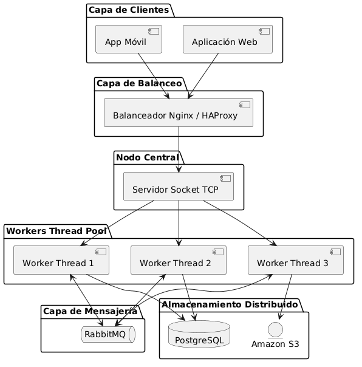

# PFO 3: Rediseño como Sistema Distribuido (Cliente-Servidor)

Este proyecto implementa la migración de un sistema de gestión a una infraestructura distribuida basada en Sockets TCP puros en Python. La arquitectura está diseñada para delegar tareas de manera asíncrona utilizando un Pool de Hilos distribuidos (Workers).

## 📊 Diagrama de Arquitectura de Componentes

A continuación, se detalla el flujo de datos del sistema, mapeando las conexiones desde los clientes hasta las bases de datos y colas distribuidas:



## 🧱 Detalle de la Infraestructura Diseñada

* **Clientes (Móviles/Web):** Componentes frontend distribuidos que generan demandas de procesamiento de datos por red.
* **Balanceador de Carga (Nginx/HAProxy):** Actúa como proxy inverso administrando la concurrencia y distribuyendo conexiones eficientemente.
* **Servidor Central (Orquestador):** Expone un socket de escucha TCP encargado de recibir y enrutar solicitudes.
* **Workers Thread Pool:** Pool de hilos de ejecución en paralelo (`ThreadPoolExecutor`) que procesa de manera asíncrona las tareas críticas sin bloquear el hilo principal de comunicación de red.
* **Capa de Mensajería (RabbitMQ):** Middleware encargado de la gestión de colas de mensajes asíncronos y sincronización inter-nodo.
* **Almacenamiento Distribuido:** Capa de datos relacionales robusta en **PostgreSQL** combinada con almacenamiento elástico de objetos pesados o imágenes en **Amazon S3**.

## 🚀 Guía de Ejecución Local

Para simular este entorno distribuido de forma local en su máquina de desarrollo, abra dos terminales independientes en Visual Studio Code:

1. **Terminal 1 - Levantar el Servidor Orquestador:**
   ```bash
   python servidor.py